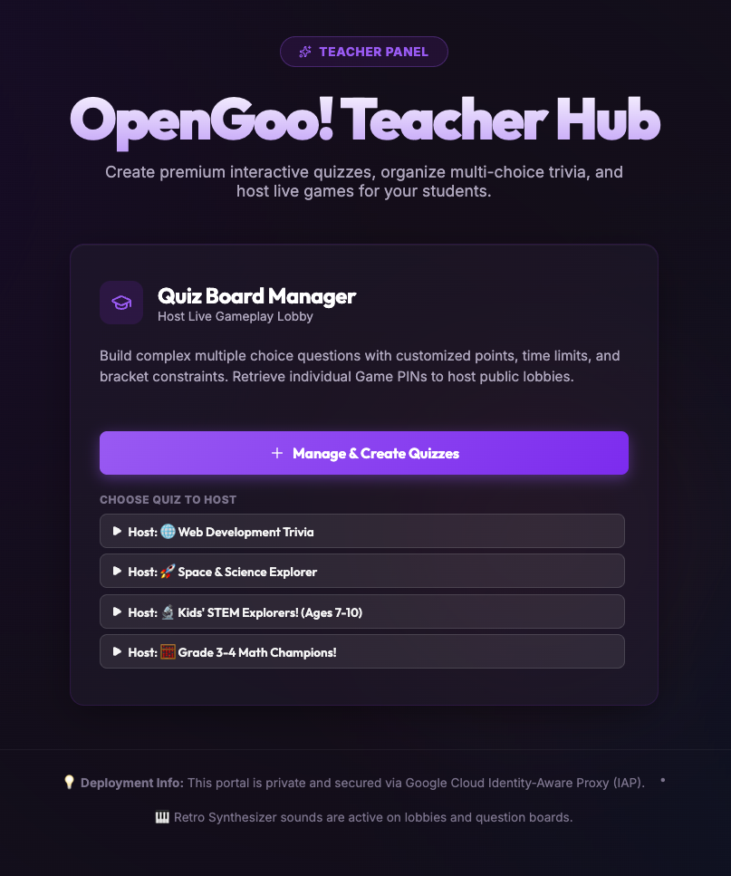
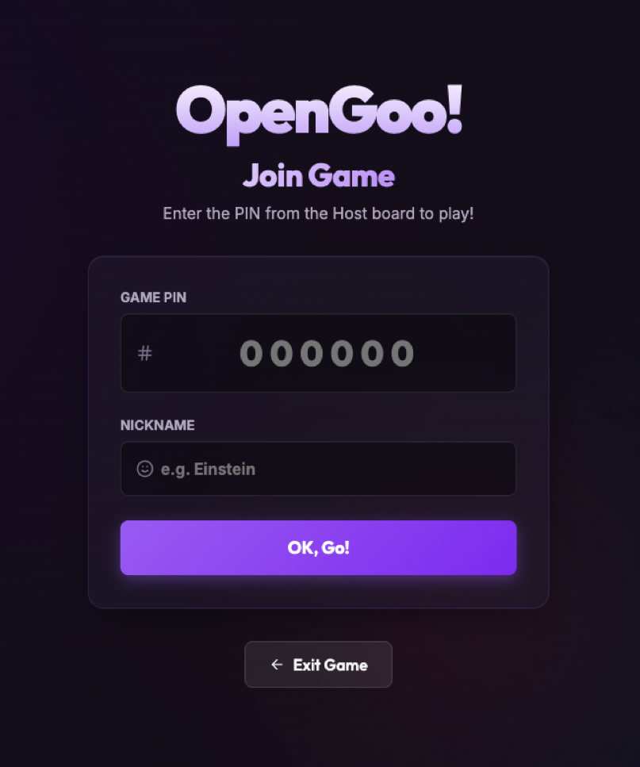
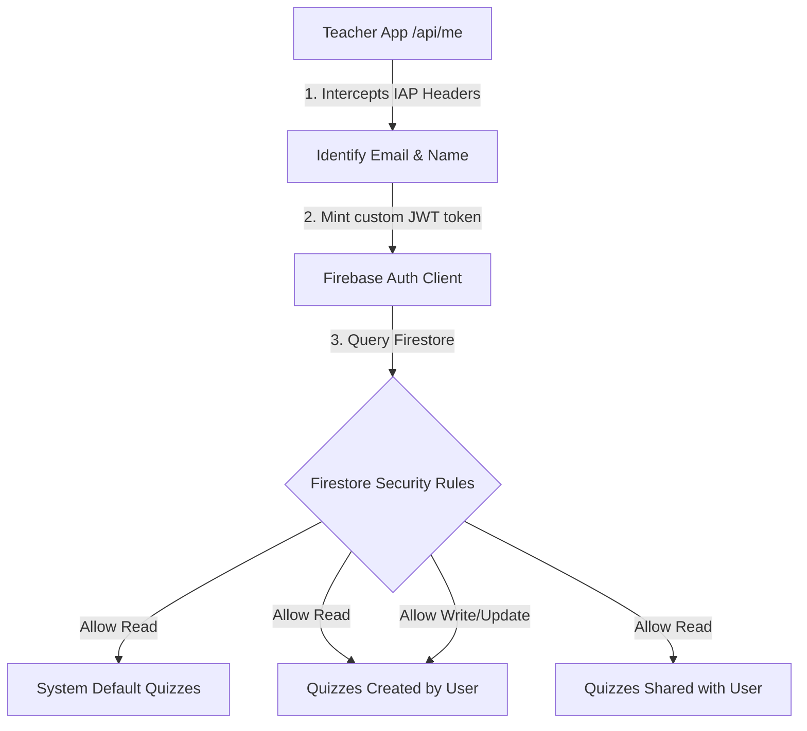

# 🌐 OpenGoo! – Live Multiplayer Quiz App

A live interactive multiplayer quiz platform structured as a secure NPM Workspaces Monorepo. Deploys as dual microservices on Google Cloud Run, separating the secure Teacher Hub (protected via Identity-Aware Proxy) from the public Student Client.

Scaffolded as a decoupled NPM Workspaces monorepo workspace.

<p align="center">
  
  
</p>

## Architecture

OpenGoo! is architected natively to run as serverless microservices on **Google Cloud Run** and **Google Firestore**. The codebase is structured as an NPM Workspaces Monorepo where both microservices share business logic and schema definitions from a common module, and compile into independent container images deployed permanently to Cloud Run.

```
                               +-----------------------------+
                               |     Monorepo Workspace      |
                               |    NPM Workspaces Structure |
                               +--------------+--------------+
                                              |
                     +------------------------+------------------------+
                     |                                                 |
                     v                                                 v
       +----------------------------+                    +----------------------------+
       |   packages/teacher-app     |                    |   packages/student-app     |
       |    Teacher Hub Dashboard   |                    |   Student Gamepad Client   |
       |    Cloud Run: opengoo-teacher                   |   Cloud Run: opengoo-student|
       +-------------+--------------+                    +-------------+--------------+
                     |                                                 |
                     |                 +--------------------+          |
                     +---------------->|   packages/core    |<---------+
                                       |    (Shared Lib)    |
                                       +---------+----------+
                                                 |
                                                 v
                                       +--------------------+
                                       | Firestore Database |
                                       +--------------------+

-----------------------------------------------------------------------------------------
                                  PRODUCTION TOPOLOGY
-----------------------------------------------------------------------------------------

  Authorized User                          Teacher Group                           Student Player
       |                                         |                                       |
       | (Google OAuth)                          | (Google OAuth)                        |
       v                                         v                                       v
  +------------------------------------------------------+                               |
  |             GCP Identity-Aware Proxy (IAP)           |                               |
  |         (Authorized: user/group with accessor role)  |                               |
  +--------------------------+---------------------------+                               |
                             |                                                           |
                             | (authenticated forward)                                   v
                             v                                               +-----------------------+
               +---------------------------+                                 | Public Internet (HTTP)|
               |      opengoo-teacher      |                                 +-----------+-----------+
               |  (Private Cloud Run App)  |                                             |
               +-------------+-------------+                                             v
                             |                                             +---------------------------+
                             | (read/write)                                |      opengoo-student      |
                             |                                             |  (Public Cloud Run App)   |
                             |                                             +-------------+-------------+
                             |                                                           |
                             +---------------------------+-------------------------------+ (read/write)
                                                         |
                                                         v
                                           +---------------------------+
                                           |    Firestore Database     |
                                           |  (Real-time State Sync)   |
                                           +---------------------------+
```

## Packages

| Package | Location | Target | Description |
|---------|----------|--------|-------------|
| `@opengoo/core` | `packages/core` | Shared Lib (Node/Browser) | Shared data schemas, Web Audio synthesizers, offline fallbacks, and Grade 3-4 math quiz resources. |
| `packages/teacher-app` | `packages/teacher-app` | Cloud Run + GCP IAP | Admin dashboard, quiz manager, live host control, protected under Google Identity-Aware Proxy. |
| `packages/student-app` | `packages/student-app` | Cloud Run (Public) | Public student remote gamepad controller for engaging live quiz multiplayer gameplay. |

---

## 📂 Repository Structure

The monorepo structure and descriptions of key files are organized as follows:

```
.
├── .env.example                # Template for environment configurations (GCP project, region, and Firebase keys)
├── package.json                # Monorepo root defining NPM workspaces and custom dev/build scripts
├── firestore.rules             # Declarative security rules for restricting unauthorized Firestore reads/writes
├── firebase.json               # Local Firebase resource configuration pointing to security rules
├── nginx.conf.template         # Nginx configuration template used inside production Cloud Run containers
├── setup-firebase.sh           # Programmatic shell setup script to enable GCP APIs, register Web Apps, and sync keys
├── deploy-teacher.sh           # Cloud Run deployment script for building & protecting the private Teacher Hub (IAP)
├── deploy-student.sh           # Cloud Run deployment script for building & exposing the public Student Gamepad
├── cloudbuild-teacher.yaml     # Cloud Build pipeline configuration for compiling packages/teacher-app
├── cloudbuild-student.yaml     # Cloud Build pipeline configuration for compiling packages/student-app
└── packages/                   # Monorepo Workspace sub-packages
    ├── core/                   # Shared business logic, schemas, offline sync engine, and audio synths
    ├── teacher-app/            # Teacher Dashboard & Game Host single-page application (Private)
    └── student-app/            # Student mobile remote gamepad single-page application (Public)
```

### Key Directories & Files
*   **`packages/core/`**: Consolidates all database models, default quiz collections, and audio synths. Symlinked natively by NPM Workspaces so other packages can import shared modules effortlessly.
*   **`packages/teacher-app/`**: A secure portal allowing teachers to launch, orchestrate, and control quiz competitions in real-time. Deployed as a private container on Google Cloud Run protected by IAP.
*   **`packages/student-app/`**: An optimized public client designed as a responsive remote gamepad. It connects students seamlessly to live game lobbies on their smartphones or other devices without a login barrier.
*   **`setup-firebase.sh`**: Simplifies the entire onboarding experience. Runs programmatically to set up Firebase, fetch credentials, write them directly to your `.env`, and deploy Firestore rules.
*   **`deploy-*.sh`**: Direct shell wrappers triggering GCP Cloud Build to compile containers and execute Zero-Downtime deployments to Cloud Run with customized security profiles.

---

## Capabilities & Key Features

*   **Anytime, Anywhere Quiz Competitions:** Empower hosts and teachers to dynamically create, manage, and host live quiz competitions anytime and from anywhere, enabling guest players and students to seamlessly connect and participate in real-time.
*   **Multi-User Isolation & Collaborative Sharing:** Isolates custom quizzes by their respective creator accounts under the private Teacher Hub. Teachers can securely share their quiz sets with other specific teachers. Shared quizzes are read-and-host only for recipients, allowing colleagues to host them directly or duplicate them into their own personal libraries for customization.
*   **Grade 3-4 Math Champions Quiz:** Features a pre-baked 20-question math curriculum (addition, subtraction, multiplication, division, brackets) designed to auto-seed on the first launch of the Teacher Hub.
*   **Web Audio Synth Synthesizers:** Provides dynamic sound effects synced to client events without requiring large asset downloads.
*   **Secure Access-Gate:** Built-in integrated secure protection using Google Cloud Identity-Aware Proxy (IAP) directly on the Serverless Cloud Run endpoint.
*   **Robust State-Based Synchronization:** Engineered with a state-based real-time replication model via Firestore snapshots (with automated BroadcastChannel backup for local dev) that synchronizes gameplay phases (Lobby, Get Ready, Question, Reveal, and Podium) across all clients with robust state-guarding to prevent connection lag or skipped question lockouts.

---

## 🔒 Multi-User Isolation & Collaborative Sharing

OpenGoo! is designed for collaborative educational environments, featuring secure tenant isolation and quiz sharing among teachers.

### Architectural Workflow



1. **Identity & Secure Minting:** When a teacher accesses the Hub via Google Cloud Run, Google IAP handles authentication. The Node.js Express server (`server.js`) intercepts the authenticated email (`X-Goog-Authenticated-User-Email`) and securely mints a **Firebase Custom Auth Token** matching that identity.
2. **Client-Side Authorization:** The single-page React app receives the custom token and logs into Firestore client-side.
3. **Granular Security Rules:** Firestore security rules restrict operations on `/quizzes/{quizId}`:
   - **Read:** Allowed if the quiz is marked `isSystemDefault`, or if `creator == request.auth.token.email`, or if `request.auth.token.email in sharedWith`.
   - **Create / Delete / Update:** Restricted strictly to the owner (`creator == request.auth.token.email`).
4. **Collaborative Scope (Read & Host Only):** If Teacher A shares a quiz with Teacher B, it appears under Teacher B's **"Shared with Me"** section. Teacher B can immediately host live lobbies of Teacher A's quiz, but cannot modify it directly. To customize, Teacher B can click **Duplicate to Edit** to clone the quiz as an independent copy owned by themselves.

### Local Mocking & Switching (Dev Mode)

To facilitate swift developer testing without requiring active GCP IAP instances, OpenGoo! provides a premium developer profile switcher when running locally:
- **Mock Fallback:** Local developer environments gracefully fall back to local mocks (such as `teacher@opengoo.local` or `colleague@opengoo.local`).
- **Profile Selector:** A glowing glassmorphic select dropdown is visible at the top-right corner of the Hub. Swapping profiles instantly updates the workspace view and filters local storage or Firestore items in real-time, matching exactly how isolated subscriptions behave in production.

---

## 🏆 Example Competition Flow

Here is a step-by-step walkthrough of how a live competition works from scratch:

```
[ Step 1: Secure Host Login ]
      │ (Teacher signs in securely through Google Workspace IAP)
      ▼
[ Step 2: Launch Live Game Lobby ]
      │ (Selects the math quiz; a unique 6-digit Game PIN is generated)
      ▼
[ Step 3: Guests Join via Game PIN ]
      │ (Players visit public student client, enter Game PIN and nickname)
      ▼
[ Step 4: Host Starts the Game ]
      │ (Host clicks "Start Game" on their projected dashboard)
      ▼
[ Step 5: Real-time Play & Sync ]
      │ (Host projects questions/timer; players tap responsive gamepads)
      ▼
[ Step 6: Real-time Leaderboards & Crown ]
        (System processes answers, plays synth sounds, & crowns the winner!)
```

### 1. Host Initial Setup & Authentication
The teacher or competition host logs into the secure **Teacher Hub Portal** (`https://opengoo-teacher-xxxx.run.app`) from their laptop or classroom computer. Because access is secured by Identity-Aware Proxy (IAP), Google handles the secure login.

### 2. Launching the Live Lobby
Once inside the dashboard, the host selects an available competition set (e.g., the pre-baked **Grade 3-4 Math Champions** quiz) and clicks **Host Game**.
* This opens a real-time multiplayer lobby page.
* A prominent **Game PIN** (e.g., `483921`) is dynamically generated and displayed on-screen.

### 3. Guests & Students Joining
Students or guests open the public **Student Gamepad client** (`https://opengoo-student-xxxx.run.app`) on their mobile phones, tablets, or laptops.
* No Google account or login is required for players.
* They simply enter the **6-digit Game PIN** and type in their **Nickname** (e.g., `SpeedyMaths`).
* As players join, their nicknames instantly slide into the live Teacher Hub lobby screen in real-time.

### 4. Interactive Live Gameplay
Once all players are in, the host shares/projects the Teacher Hub dashboard screen and clicks **Start Game**.
* **On the Main Screen (Host):** The questions (e.g., `(12 + 8) × 3 = ?`) are projected along with a ticking 20-second countdown timer.
* **On the Player Devices (Guests):** The screen turns into an interactive gamepad featuring four colored answer buttons (Red, Blue, Yellow, Green) that correspond to the choices shown on the projected screen.
* Players tap the correct colored pad. Faster responses award higher score points!

### 5. Leaderboard & Winner Crowned
After each question, a live bar chart shows how many players chose each option, followed by a podium scoreboard showing the top 5 contestants. When the final question is answered, the podium crowns the gold, silver, and bronze winners with celebratory Web Audio synth audio effects!

---

## 🛠 Prerequisites

Before starting, make sure you have the following installed locally:
*   [Node.js](https://nodejs.org/) (v18 or higher recommended)
*   [Google Cloud SDK (gcloud CLI)](https://cloud.google.com/sdk/docs/install)

---

## 🚀 Setup 

### 1. Firebase Initialization
Create a `.env` configuration file in your workspace root directory:

```env
# GCP Deployment Configurations
GCP_PROJECT_ID=your-gcp-project-id
GCP_REGION=gcp-location #e.g. asia-east2
```

Then run the automated setup script. This script will programmatically enable Google Cloud APIs, register your web client, write your Firebase client credentials to the `.env` file, and deploy security rules:

```bash
./setup-firebase.sh
```

> [!IMPORTANT]
> Running `./setup-firebase.sh` is mandatory prior to local development or deployment to ensure all `VITE_FIREBASE_*` variables are properly generated.

### 2. Running Locally (optional)

Install workspace dependencies and start the local development servers:

```bash
# Install and link workspaces
npm install

# Start Private Teacher Portal (Port 5173)
npm run dev:teacher

# Start Public Student Gamepad (Port 5174)
npm run dev:student

# Compile production bundles
npm run build:all
```

---

## ☁️ Cloud Deployment

The student client and teacher dashboard are deployed to Google Cloud Run as separate, optimized microservices:

### 1. Deploy Public Student Gamepad
The student client is open to the public so that student players can join live lobbies without requiring a login:

```bash
./deploy-student.sh
```
*   **Pipeline Config:** `cloudbuild-student.yaml`
*   **Security Context:** Public (`--allow-unauthenticated`)

### 2. Deploy Secure Teacher Hub
The teacher portal is secure and protected under Google Cloud Identity-Aware Proxy (IAP):

```bash
./deploy-teacher.sh
```
*   **Pipeline Config:** `cloudbuild-teacher.yaml`
*   **Security Context:** Secure (`--no-allow-unauthenticated` + `--iap` activated)

---

## 🔒 IAP Whitelist Configuration

Once deployed, the Teacher Hub will block all external requests with a "You don't have access" screen until you explicitly authorize them.

To grant access:

### Via Google Cloud Shell / CLI
Run the IAM policy binding command (replace `PRINCIPAL` with your target email or group, e.g. `group:gcp-developers@example.com` or `user:user@example.com`):

```bash
gcloud projects add-iam-policy-binding your-project-id \
    --member="PRINCIPAL" \
    --role="roles/iap.httpsResourceAccessor" \
    --condition=None
```

### Via Google Cloud Console
1. Navigate to the **Security > Identity-Aware Proxy** console.
2. Under the **Resources** tab, select the check box next to the **`opengoo-teacher`** backend service.
3. In the right-hand panel, click **Add Principal**.
4. Enter the Google account or Workspace Group (e.g. `gcp-developers@example.com`).
5. Assign the role: **`IAP-secured Web App User`** (`roles/iap.httpsResourceAccessor`).

## 🤖 Headless & CI/CD Environments

In automated environments (such as GitHub Actions, GitLab CI, Cloud Build, or AI coding assistants), interactive authentication is not possible. OpenGoo! fully supports standard, non-interactive Google Cloud and Firebase authentication:

### 1. Headless Authentication
To run `setup-firebase.sh` or any deployment scripts in CI/CD, authenticate using a **Google Cloud Service Account JSON Key**:
1. Point the `GOOGLE_APPLICATION_CREDENTIALS` environment variable to your Service Account JSON key file:
   ```bash
   export GOOGLE_APPLICATION_CREDENTIALS="/path/to/service-account-key.json"
   ```
2. Activate the service account with the `gcloud` CLI:
   ```bash
   gcloud auth activate-service-account --key-file="$GOOGLE_APPLICATION_CREDENTIALS"
   gcloud config set project "your-gcp-project-id"
   ```
3. When running `setup-firebase.sh`, the script automatically fetches the access token from your active service account credentials. Furthermore, since Firestore security rules are deployed natively via standard Google REST APIs (using `curl` and the active `gcloud` identity), this completely avoids requiring a deprecated `FIREBASE_TOKEN` or any browser-based interactive Firebase logins!

### 2. Cloud Build GCS Permissions
During container compilation, Cloud Build uploads source files as a tarball to a Google Cloud Storage bucket (`gs://[PROJECT_ID]_cloudbuild`) and extracts them. 

In newly provisioned or highly restricted Google Cloud projects, the default Compute Engine service account (`[PROJECT_NUMBER]-compute@developer.gserviceaccount.com`) might lack permission to read or write to Cloud Storage buckets, causing Cloud Build to fail.

#### Diagnostic and Verification
Our deployment scripts (`deploy-student.sh` and `deploy-teacher.sh`) automatically perform a proactive IAM check to verify if the default Compute service account has proper Storage access (`roles/storage.admin` or `roles/editor`).

#### Resolution
If the permissions check fails or Cloud Build reports a bucket access error, grant the **Storage Admin** role to the default Compute service account:

```bash
# Retrieve your project number
PROJECT_NUMBER=$(gcloud projects describe "YOUR_PROJECT_ID" --format="value(projectNumber)")

# Grant Storage Admin permissions
gcloud projects add-iam-policy-binding "YOUR_PROJECT_ID" \
    --member="serviceAccount:${PROJECT_NUMBER}-compute@developer.gserviceaccount.com" \
    --role="roles/storage.admin"
```

---

## 📄 License

All rights reserved. No license is granted for redistribution or commercial use of this software, in whole or in part, without explicit written permission.
